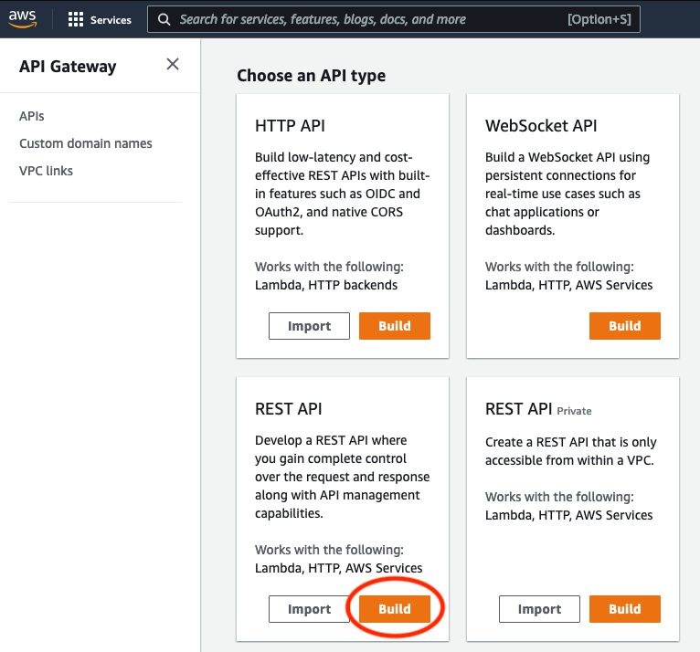
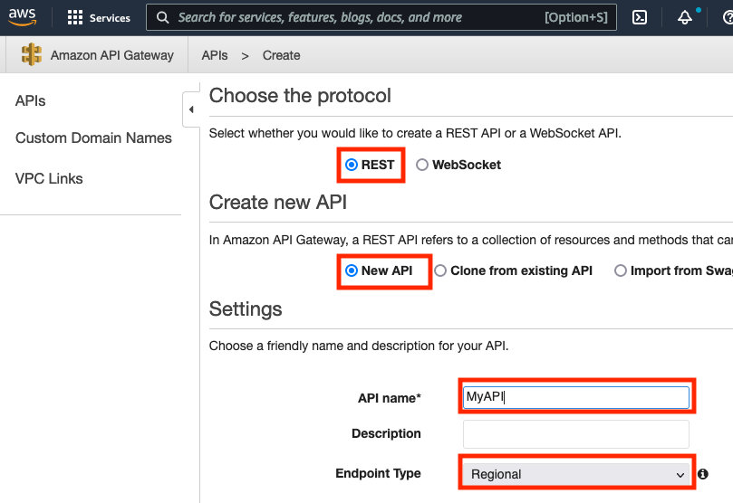
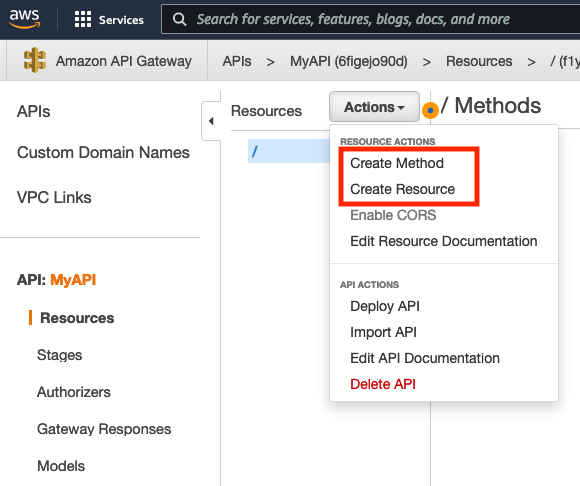
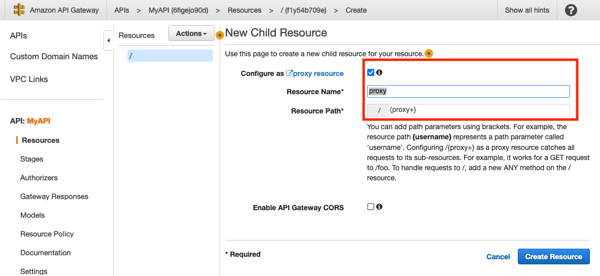
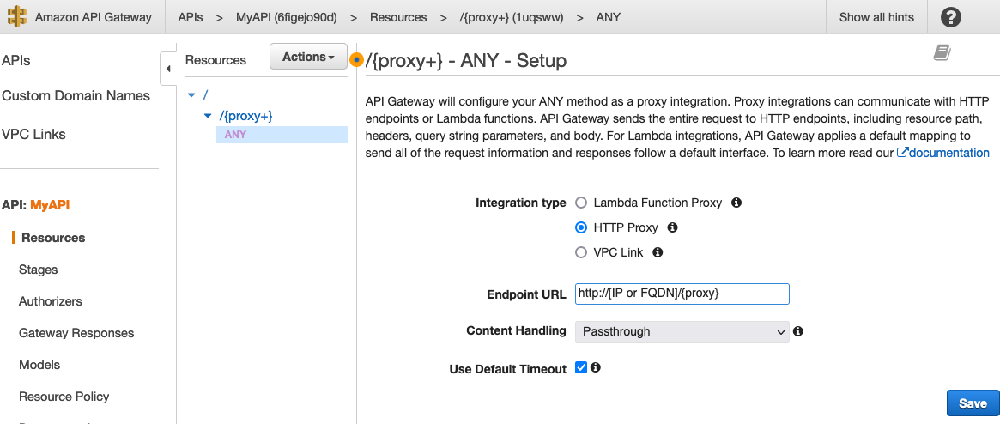
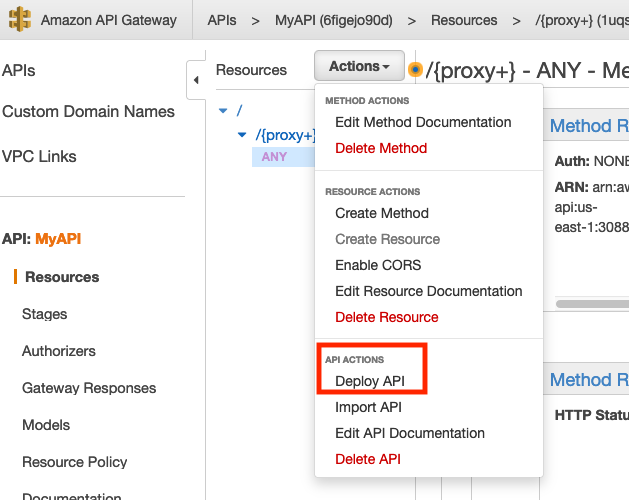
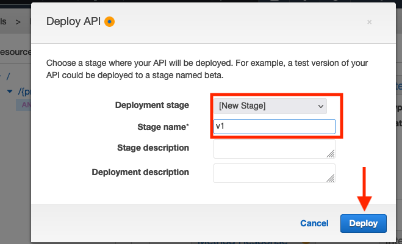
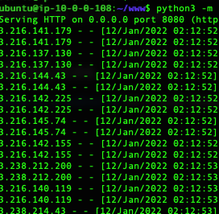

## Rotating Source IPs with AWS
There are multiple reasons one might need to hide their source IP address. From a testing perspective, a client might implement IP based block. Thus, you need a method to automatically rotate your source IP address to bypass such controls for target enumeration, password spraying, etc. Additionally, you might need to prevent a HTTP or REST API endpoint from knowing your src IP address for multiple reasons. One could leverage [AWS API Gateway](https://aws.amazon.com/api-gateway/).

## Setting up API Gateway
Login to your AWS account and go to [API Gateway](https://console.aws.amazon.com/apigateway/)

* Next, on the "Choose an API Type" page, click Build under REST API.

* On the "Choose the protocol" page, ensure that REST and New API are selected.  Name your API and set the Endpoint Type as Regional.

* Click the Actions button on the drop-down menu and select either Create Method or Create Resource based on your needs/implementation requirements. In this case, we will choose Create Resource as we plan to configure a [proxy resource](https://docs.aws.amazon.com/apigateway/latest/developerguide/api-gateway-set-up-simple-proxy.html#api-gateway-proxy-resource%3Ficmpid=docs_apigateway_console). 

* On the following page, "New Child Resource" you need to check for the box to configure as a proxy resource and add the Resource Name and Resource Path.

* Select HTTP Proxy, add the Endpoint URL, and click Save on the next page.

* Click the Actions button on the drop-down menu and select Deploy API.

* On the Deploy API window, select "[New Stage" for Deployment stage and add a Stage Name followed by clicking Deploy.  Note if you need to spoof your source IP add the [X-Forwarded-For](https://developer.mozilla.org/en-US/docs/Web/HTTP/Headers/X-Forwarded-For) header - see [OPSEC](#opsec) note. 

## Testing 
To verify that our source IPs do rotate, we can access URL you entered for the Endpoint via the Invoke URL provided by API Gateway.

From a shell on the target Endpoint start a simple web server
        
        python3 -m http.server 8080

Then from another terminal shell 

        while true; do curl -k  https://[AWS PROVIDE INVOKE URL]/test; done

## Example - [Shodan](https://www.shodan.io/)
The following example utilizes an AWS API Gateway for making [Shodan](https://developer.shodan.io/api) REST calls via an imported ([json file](ShodanAPIGW.json) or [yaml file](ShodanAPIGW.yaml))
1.  Select import under the "REST API" option on the "Choose an API type"
2.  Deploy the API, in this case we selected [New Stage] for deployment stage and v1 for Stage name
3.  The invoke URL is https://2o6r8qlhv8.execute-api.us-east-1.amazonaws.com/v1
4.  One can call the Shodan API via the following example:

        curl -X GET "https://2o6r8qlhv8.execute-api.us-east-1.amazonaws.com/v1/shodan/host/65.144.1.1?key=XYZ123"

## OPSEC
One may also choose to add a HTTP under "integration Requests" such as "X-Forwarded-For” with a valid IP in single quote (e.g., ‘4.4.4.4’) for the Mapped from field.  

## Additional Resources
Using [AWS Lambda as a redirector](https://blog.xpnsec.com/aws-lambda-redirector/) for Cobalt Strike
