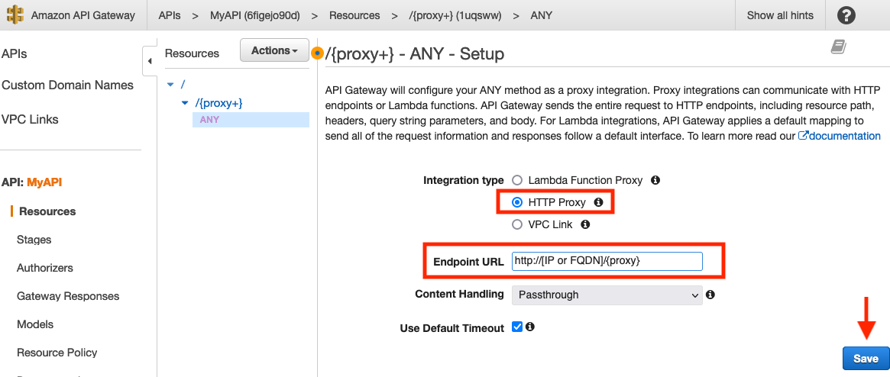

## Rotating Source IPs in AWS
There are multiple reasons one might need to hide their source IP address. From a testing perspective, a client might implement IP based block. Thus, you need a method to automatically rotate your source IP address to bypass such controls for target enumeration, password spraying, etc. Additionally, you might need to prevent a HTTP or REST API endpoint from knowing your src IP address for multiple reasons. One could leverage [AWS API Gateway](https://aws.amazon.com/api-gateway/).

## Setting up API Gateway
Login to your AWS account and go to [API Gateway](https://console.aws.amazon.com/apigateway/)

* Click API Gateway 

* Next on the "Choose an API Type" page click Build under REST API

* On the "Choose the protocol" page ensure that REST and New API are selected.  Name your API and set the Endpoint Type as Regional

* Click Actions button on the drop-down menu and select either Create Method or Create Resource based on your needs / implementation requirements.  In this case we will select Create Resource as we plan to configure a [proxy resource](https://docs.aws.amazon.com/apigateway/latest/developerguide/api-gateway-set-up-simple-proxy.html#api-gateway-proxy-resource%3Ficmpid=docs_apigateway_console) 

* On the following page "New Child Resource" you need to Check for the box for configure as proxy resource and add the Resource Name and Resource Path.

* On the next page select HTTP Proxy and add the Endpoint URL followed by clicking save

* Click Actions button on the drop-down menu and select Deploy API

* On the Deploy API window select new stage for Deployment stage and add a Stage Name followed by clicking Deploy

## Testing 
To verify that our source IPs do rotate we can access URL you entered for the Endpoint via the Invoke URL provided by API Gateway.

From a shell on the target Endpoint start a simple web server
        
        python3 -m http.server 8080

Then from another terminal shell 

        while true; do curl -k  https://[AWS PROVIDE INVOKE URL]/test; done

## Additional Resources
Using [AWS Lambda as a redirector](https://blog.xpnsec.com/aws-lambda-redirector/) for Cobalt Strike
